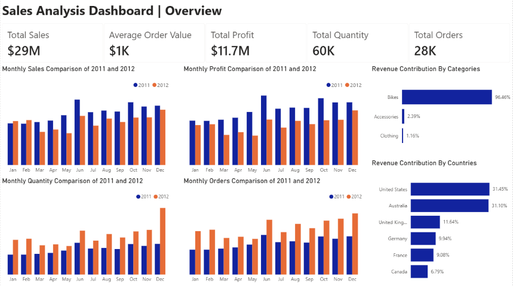
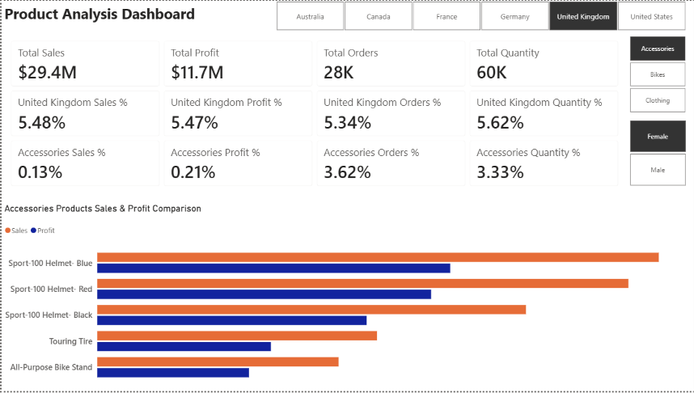

# Ecommerce Sales 
End-to-End Retail Analysis to uncover revenue trends, top selling products and customer behavior
# EDA 
I performed EDA to explore and understand the Ecommerce Sales Database. The database has two dimension tables and one fact table. I analyzed dimensions, measures and dates to understand overall business. I also highlighted the missing values in the database.
# Advanced SQL Analytics
This time I move forward with Advance Analysis using SQL to perform time-series analysis, cumulative analysis, product performance analysis etc. I also designed a customer and product report, which consolidates key metrics and KPIs for each customer and product.
# Power BI Dashboard

 

 

# Insights
<ul>
  <li><b>Bikes Category</b> is dominating the revenue and profit as compared to <b>Accessories</b> and <b>Clothing.</b></li>
  <li>Components Category <b>LITERALLY HAVE NO SALES AT ALL.</b></li>
  <li>In <b>December</b> highest no of orders were placed and quantity were sold but <b>June</b> has the highest <b>revenue and Profit.</b></li>
  <li>Canada has revenue contribution of <b>6.79% (lowest Contributor)</b></li>
  <li><b>Accessories</b> and <b>clothing</b> have higher revenue and profit contribution in <b>US, Austrailia and Canada.</b></li>
  <li><b>Austrailia</b> Customer Contribution is ~ 19.5% and <b>US</b> Customer contribution is ~ 40.5%</li>
  <li>But <b>Austrailia</b> Revenue Contribution is ~ 30.9% and <b>US</b> Revenue contribution is ~ 31.2%</li>
  <li> It means that Austrailia is generating more revenue (30.9%) than the customers % (19.5%) it is holding whereas US is generating less revenue (31.2%) than the customers % (40.5%) it is holding.</li>
  <li>In Austrailia, Married Male customers % is higher ~(5.5%) than Single Female customers ~(4.8%) but Revenue & Profit Contribution is higher for Single Female customers ~(9.1%) and (9%) than Married male ~(7.7%) and (7.6%).</li>
  <li>Female customers have higher bikes sales% (15.4%) than male customers (14.7%)</li>
</ul>

# Recommendations
<ul>
<li>Marketing Efforts needs to be adjusted for Accessories and Clothing Category.</li>
<li><b>SPECIAL ATTENTION</b> is required for <b>Components</b> Category.</li>
<li>US customers to revenue ratio needs to be rebalanced relative to other countries.</li>
<li>In Austrailia Single Female Customers have more potential than married male customers. So marketing strategy needs to be revised.</li>
<li>Bikes Category is attracted more by Female customers</li>

</ul>

