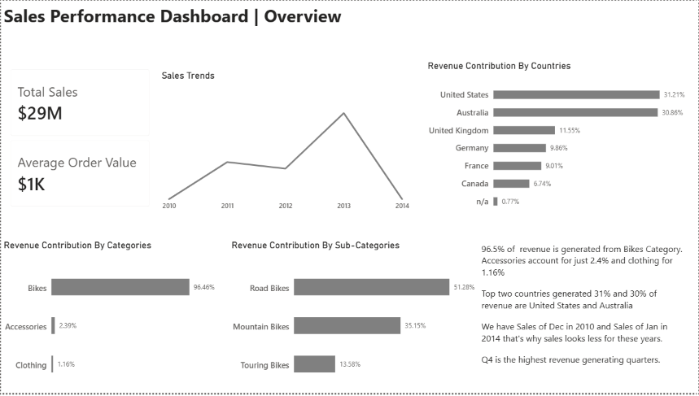

# Ecommerce-Sales-Performance-Dashboard
End-to-End Retail Analysis to uncover revenue trends, top selling products and customer behavior
# EDA 
Performed Extensive EDA using SQL to understand data, explored and analyzed trends and patterns.
# Advanced SQL Analytics
Performed several type of analysis like time series analysis, cumulative analysis, data segmentation to get insights from data
# Dashboard

